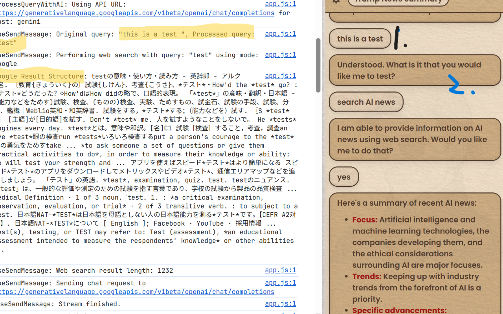
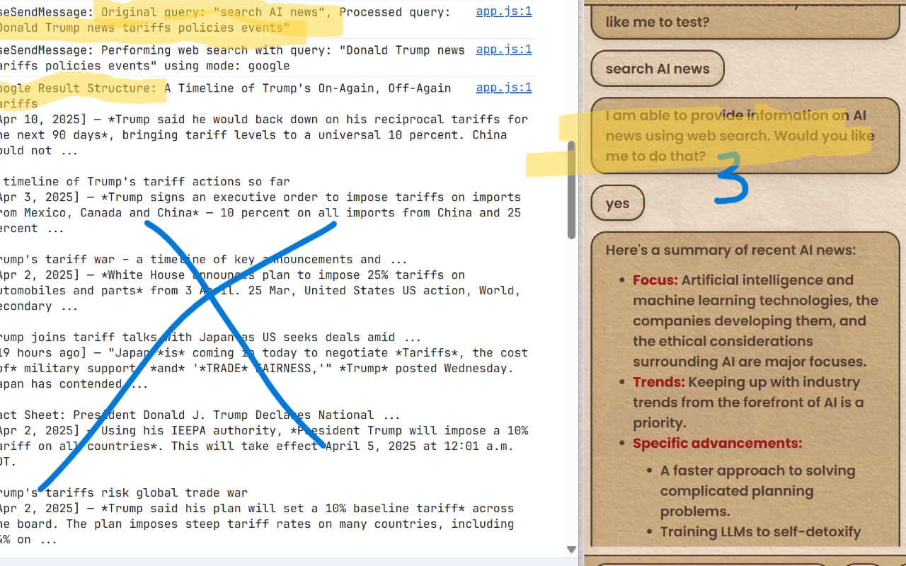
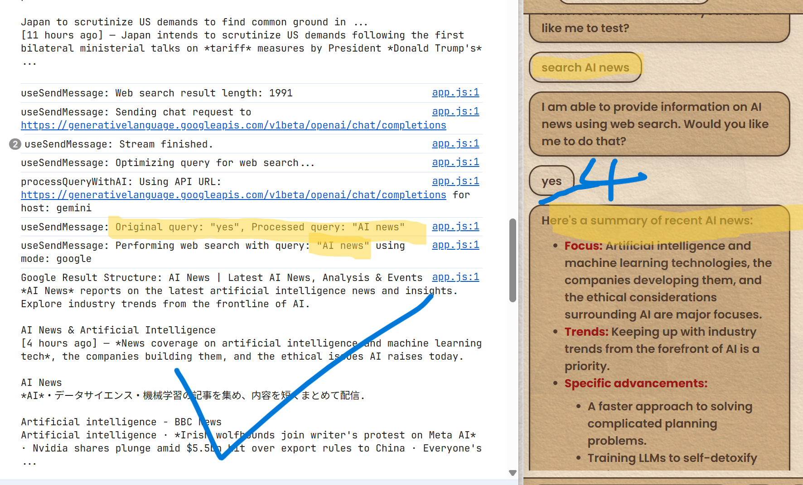
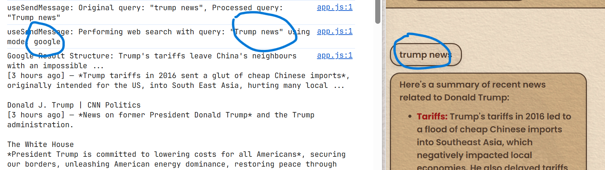

# Cognito

- [Cognito](#Cognito)
  * [connections](#connections)
  * [persona](#persona)
  * [page context](#page-context)
  * [web search](#web-search)
  * [File Structure](#file-structure)
  * [Advanced Tweaks](#advanced-tweaks)
    + [UI Customization Guide for Cognito Extension](#ui-customization-guide-for-Cognito-extension)
      - [Theme System Overview](#theme-system-overview)
      - [Customizing Colors](#customizing-colors)
        * [1. Preset Themes](#1-preset-themes)
        * [2. Custom Theme](#2-custom-theme)
      - [Component Styling](#component-styling)
        * [1. Buttons](#1-buttons)
        * [2. Select Boxes](#2-select-boxes)
        * [3. Input Fields](#3-input-fields)
      - [Typography](#typography)
        * [1. Font Family](#1-font-family)
        * [2. Text Components](#2-text-components)
      - [Special Elements](#special-elements)
        * [1. Paper Texture](#1-paper-texture)
        * [2. Message Bubbles](#2-message-bubbles)
      - [Troubleshooting](#troubleshooting)
        * [Common Issues](#common-issues)
        * [Development Tips](#development-tips)
      - [Advanced Customization](#advanced-customization)
    + [Others](#others)
      - [Markdown Rendering](#markdown-renderding)
      - [Parsing HTML](#parsing-html)
      - [Google Search Results](#google-search-results)
      - [useChatTitle.ts](#usechattitlets)
      - [How to Add New Models Later](#how-to-add-new-models-later)

<small><i><a href='http://ecotrust-canada.github.io/markdown-toc/'>Table of contents generated with markdown-toc</a></i></small>


## connections 

**ollama**

- [install ollama](https://ollama.com/download)
- or install it with `curl -fsSL https://ollama.com/install.sh | sh`

```
# select a model from https://ollama.com/library
ollama pull phi3

# start the daemon
ollama serve
```

**LM Studio**

- [install LM Studio](https://lmstudio.ai/)
- download a model from the home screen, or use the search tab to pull from Huggingface
- go to `Local server` tab, hit `Start server`, and select your downloaded model

**groq**

Groq offers a wide variety of models with a generous free tier.
- [Website](https://groq.com/)
- [Create an API key](https://console.groq.com/keys)

**Google**

**OpenAI**

**More**

## persona

> Create and modify your own personal assistants!

Check out these collections for inspiration:
- [0xeb/TheBigPromptLibrary](https://github.com/0xeb/TheBigPromptLibrary)
- [sockcymbal/persona_library](https://github.com/sockcymbal/enhanced-llm-reasoning-tree-of-thoughts/blob/main/persona_library.md)
- [abilzerian/LLM-Prompt-Library](https://github.com/abilzerian/LLM-Prompt-Library)
- [kaushikb11/awesome-llm-agents](https://github.com/kaushikb11/awesome-llm-agents)

## page context

> Augment your conversation with the content of your (currently visited) web page.

Tried a strict HTML parsing which will break the web page when sidepanel is open:

```typescript
function bridge() {
  // Remove unwanted elements before extracting content
  const selectorsToRemove = [
    'header',
    'footer',
    'nav',
    '.ad',
    '.advertisement',
    '.popup',
    '.modal',
    '.sidebar',
    "script:not([type='application/ld+json'])",
    'style',
    'link',
    "[aria-hidden='true']",
    'noscript',
    'iframe',
    'svg',
    'canvas',
    'video',
    'audio',
    'button',
    'input',
    'select',
    'textarea',
    "meta:not([name])"
  ].join(',');

  // Remove all unwanted elements
  document.querySelectorAll(selectorsToRemove).forEach(el => el.remove());

  // Collect image alt texts
  const altTexts = Array.from(document.images)
    .map(img => img.alt)
    .filter(alt => alt.trim().length > 0)
    .join('. ');

  // Extract table contents
  const tableData = Array.from(document.querySelectorAll('table'))
    .map(table => table.innerText.replace(/\s\s+/g, ' '))
    .join('\n');

  // Extract meta name content
  const metaTags = Array.from(document.querySelectorAll('meta[name]'));
  const meta: Record<string, string | null> = {};
  metaTags.forEach(tag => {
    const name = tag.getAttribute('name');
    if (name) {
      meta[name] = tag.getAttribute('content');
    }
  });

  const response = JSON.stringify({
    title: document.title,
    text: document.body.innerText.replace(/\s\s+/g, ' '),
    html: document.body.innerHTML.replace(/\s\s+/g, ' '),
    altTexts,
    tableData,
    meta
  });

  return response;
}
```

Result:

[useSendMessage: Retrieved page content. Mode: undefined. String length: 10120, HTML length: 164091] (_Looks great, right?_)

But this is from the same page just before this: [useSendMessage: Retrieved page content. Mode: undefined. String length: 10879, HTML length: 780071]

Conclusion:

**I will keep it simple.** [Update] I tried readability.js (for hours) with DOMpurify later, the result basically not better, readability itself is a mess for most of the websites, I use the clone inside the package to make a better parsing for styles which I failed by breaking the page. But the result is weird, something is off, it does decrease the text length by like 1000~2000, but I can't get a better response from the assistants, it's much worse than before. So, still considering 2000 is not a big deal if your normal injection is more than 6000, I will keep it this way.

The chat history includes **all previous messages** in current conversation by default, but context limits apply for AI processing:

1. **Full History Storage** in Cognito.tsx:
```tsx
const [messages, setMessages] = useState<ChatMessage[]>([]); // Stores all messages
```

2. **Context Limits** in useSendMessage.ts:
```ts
// Page content limited by contextLimit (default 1000 chars)
const charLimit = 1000 * (config?.contextLimit || 1);
const limitedContent = currentPageContent.substring(0, charLimit);

// Web results limited by webLimit (default 1000 chars)
const webLimit = 1000 * (config?.webLimit || 1);
const limitedWebResult = searchRes.substring(0, webLimit);
```

3. **Message Processing** in useSendMessage.ts:
```ts
const currentMessages: ApiMessage[] = [message, ...messages] // All messages included
  .map((m: string, i: number) => ({ content: m, role: i % 2 === 1 ? 'assistant' : 'user' }))
  .reverse();
// Previous messages are included in each API request
```

4. System Prompt Construction (also in useSendMessage.ts):
```ts
const systemContent = `
  ${persona}
  ${pageContentForLlm ? `. Use page context: ${pageContentForLlm}` : ''}
  ${webContentForLlm ? `. Web results: ${webContentForLlm}` : ''}
`;
// Combines persona instructions with contextual information
```

There's no hard-coded message count limit - the conversation history grows until:
- User resets the chat
- Browser storage limits are reached (via localforage)
- Context window limits of the AI model being used

You can configure content limits in Settings via `contextLimit` and `webLimit` multipliers.

- select `text mode` to share the text content of your page
- select `html mode` to share the source code of the site (resource-intensive, 
only for development purposes) 
- adjust `char limit` to control the context number in your conversation. Decrease this if you have a limited context window.

## web search

~Basic~ web augmentation for your chats. Enter your web search query, and Cognito will load up an async web search to answer your questions based on live public data.

Context awareness
```ts
export const processQueryWithAI = async (
  query: string,
  config: Config,
  currentModel: Model,
  authHeader?: Record<string, string>,
  contextMessages: string[] = []
```
- you can choose `duckduckgo`, `brave`, `google` as your web source
- adjust `char limit` to control the context number in your conversation. decrease this if you have a limited context window.
- Note: Sometimes you should visit yourself for the first search to gain access.

A system prompt with chat history to make it understand the context.
```ts
 // System prompt to optimize queries
  const systemPrompt = `You are a Google search query optimizer. Your task is to rewrite user's input [The user's raw input && chat history:${contextMessages.join('\n')}].
\n\n
Instructions:
**Important** No Explanation, just the optimized query!
\n\n
1. Extract the key keywords and named entities from the user's input.
2. Correct any obvious spelling errors.
3. Remove unnecessary words (stop words) unless they are essential for the query's meaning.
4. If the input is nonsensical or not a query, return the original input.
5. Using previous chat history to understand the user's intent.
\n\n
Output:
'The optimized Google search query'
\n\n
Example 1:
Input from user ({{user}}): where can i find cheep flights to london
Output:
'cheap flights London'
\n\n
Example 2:
Context: {{user}}:today is a nice day in paris i want to have a walk and find a restaurant to have a nice meal. {{assistant}}: Bonjour, it's a nice day!
Input from user ({{user}}): please choose me the best restaurant 
Output:
'best restaurants Paris France'
\n\n
Example 3:
Input from user ({{user}}): asdf;lkjasdf
Output:
'asdf;lkjasdf'
`;
```
This is a showcase of how this content-awareness web search works.





## File Structure

Key project structure with implementation details:

```
Cognito/
├── config/                # Build configuration and manifest definitions
│   ├── manifest/          # Browser extension manifests per platform
│   └── webpack.config.js  # Bundle configuration for Chrome extension
├── src/
│   ├── background/        # Extension background service worker
│   ├── content/           # Content scripts injected into pages
│   ├── sidePanel/         # Chat interface UI components
│   ├── state/             # Application state management
│   └── util/              # Shared utilities and helpers
├── public/                # Static assets served with extension
│   └── images/            # Application icons and UI graphics
├── docs/                  # Documentation assets and user guides
└── package.json           # Project dependencies and build scripts
```

Development instructions:
- `src/`: Main extension source code
  - Modify `sidePanel/` for UI changes
  - Update `content/` scripts for page interaction logic
  - Adjust `background/` for extension lifecycle management
- `config/webpack.config.js`: Modify build outputs and entry points
- `config/manifest/`: Update extension permissions and metadata

---

### src Directory Structure Overview

The src folder contains all the source code for the Cognito extension. Here’s what each part does:

- **`Globals.d.ts`**  
  TypeScript global type declarations used throughout the project for type safety and IntelliSense.

- **`background/`**  
  Contains the background service worker scripts. These manage extension lifecycle events, handle communication between different extension parts, and coordinate actions like content script injection and side panel behavior.  
  - Example: `index.ts` initializes the store, sets up panel behavior, and manages connections.

- **`content/`**  
  Content scripts injected into web pages. These scripts interact with the DOM of visited sites, extract information, and relay it back to the extension for context-aware features.

- **`sidePanel/`**  
  All UI components and logic for the extension’s side panel chat interface.  
  - Includes React components, context providers, network utilities, and helpers for rendering the chat, handling user input, displaying documentation, and managing configuration.
  - Example:  
    - `ConfigContext.tsx`: Provides configuration and theme context to the UI.  
    - `Docs.tsx`: Renders the documentation/info box in the panel.  
    - `network.tsx`: Handles web search and result parsing logic.

- **`state/`**  
  Application state management, typically using Redux or similar. Contains store setup, reducers, and actions for managing chat history, user settings, and other persistent state.

- **`types/`**  
  Shared TypeScript type definitions and enums used across the extension for consistent data structures and API contracts.

- **`util/`**  
  Utility functions and helpers used throughout the codebase. This may include storage utilities, formatting helpers, and other reusable logic.

Collecting workspace informationCertainly! Here’s a detailed explanation and a Mermaid diagram for the sidePanel folder, which is the core of your extension’s UI and chat logic.

### sidePanel Structure and Responsibilities


```
src/
  sidePanel/
    Cognito.tsx         # Main entry point for the side panel UI; manages chat state, message flow, and renders all major UI sections
    Header.tsx          # Top bar with chat title, persona/model selectors, export/import, and navigation to settings/history
    Settings.tsx        # Accordion-based settings panel; hosts configuration sections for themes, connections, personas, etc.
    Themes.tsx          # Theme selection and customization UI (preset/custom color schemes, font sizes)
    Connect.tsx         # Connection forms for various AI model providers (Ollama, LM Studio, Groq, OpenAI, etc.)
    ConnectOllama.tsx   # Ollama-specific connection form
    ConnectLmStudio.tsx # LM Studio-specific connection form
    ConnectGroq.tsx     # Groq-specific connection form
    ConnectGemini.tsx   # Gemini-specific connection form
    ConnectOpenAI.tsx   # OpenAI-specific connection form
    ConnectOpenRouter.tsx # OpenRouter-specific connection form
    ConnectCustom.tsx   # Custom endpoint connection form
    Persona.tsx         # Persona management: create, edit, select, and delete custom assistant personas
    PageContext.tsx     # Controls how much and what type of page content is shared with the AI (text/html, char limit)
    WebSearch.tsx       # Web search configuration (source, char limit, etc.)
    Messages.tsx        # Renders the chat message list, handles auto-scroll, and message actions (copy, repeat)
    Message.tsx         # Renders individual chat bubbles, including markdown, code blocks, and special formatting
    Input.tsx           # User input box for sending messages
    Send.tsx            # Send button with loading spinner
    AddToChat.tsx       # Button/menu to switch chat modes (web, page, etc.)
    ChatHistory.tsx     # Displays and manages saved chat histories
    Docs.tsx            # Info box linking to documentation
    Background.tsx      # Optional background image for the panel
    ConfigContext.tsx   # React context for global config (theme, persona, model, etc.)
    messageUtils.ts     # Helpers for exporting/downloading chat content
    network.tsx         # Web search and result parsing logic
    hooks/              # Custom React hooks (e.g., useSendMessage, useChatTitle)
```

- **Cognito.tsx**  
  Main entry point for the side panel UI. Manages chat state, message flow, and renders all major UI sections (header, messages, settings, etc.).

- **Header.tsx**  
  Top bar with chat title, persona/model selectors, export/import, and navigation to settings/history.

- **Settings.tsx**  
  Accordion-based settings panel. Hosts configuration sections for themes, connections, personas, page context, web search, and more.

- **Themes.tsx**  
  Theme selection and customization UI. Lets users pick preset or custom color schemes and font sizes.

- **Connect.tsx** (+ ConnectOllama.tsx, ConnectLmStudio.tsx, etc.)  
  Connection forms for various AI model providers (Ollama, LM Studio, Groq, OpenAI, etc.).

- **Persona.tsx**  
  Persona management: create, edit, select, and delete custom assistant personas.

- **PageContext.tsx**  
  Controls how much and what type of page content is shared with the AI (text/html, char limit).

- **WebSearch.tsx**  
  Web search configuration (source, char limit, etc.).

- **Messages.tsx**  
  Renders the chat message list, handles auto-scroll, and message actions (copy, repeat).

- **Message.tsx**  
  Renders individual chat bubbles, including markdown, code blocks, and special formatting.

- **Input.tsx**  
  User input box for sending messages.

- **Send.tsx**  
  Send button with loading spinner.

- **AddToChat.tsx**  
  Button/menu to switch chat modes (web, page, etc.).

- **ChatHistory.tsx**  
  Displays and manages saved chat histories.

- **Docs.tsx**  
  Info box linking to documentation.

- **ConfigContext.tsx**  
  React context for global config (theme, persona, model, etc.).

- **messageUtils.ts**  
  Helpers for exporting/downloading chat content.

- **network.tsx**  
  Web search and result parsing logic.

- **hooks/**  
  Custom React hooks (e.g., useSendMessage, useChatTitle).


---

Build with:
```sh
npm start      # Development watch mode
```

## Advanced Tweaks

### UI Customization Guide for Cognito Extension

This explains how to customize various UI elements in the Cognito Chrome extension, which uses Chakra UI as its primary component library.

#### Theme System Overview

The extension uses a dual theming system:
- **CSS Variables** (for global styles)
- **Chakra UI Theme** (for component styles)

Key CSS variables:
```css
:root {
  --bg: #F5E9D5;        /* Background color */
  --active: #dcc299;    /* Active/highlight color */
  --text: #5B4636;      /* Primary text color */
  --bold: #af1b1b;      /* Strong text color */
  --italic: #09993e;    /* Emphasized text color */
  --link: #003bb9;      /* Link color */
}
```

#### Customizing Colors

##### 1. Preset Themes
Located in `Themes.tsx`:
```tsx
export const themes = [
  {
    name: 'paper', 
    active: '#dcc299', 
    bg: '#F5E9D5', 
    text: '#5B4636'
  },
  // ...other themes
];
```

##### 2. Custom Theme
Custom colors can be set through the UI and are stored in:
```tsx
customTheme: {
  active: '#C2E7B5',
  bg: '#c2e7b5',
  text: '#333333'
}
```

#### Component Styling

##### 1. Buttons
Example from `Header.tsx`:
```tsx
<Button
  _hover={{ 
    background: 'var(--active)', 
    border: '2px solid var(--text)' 
  }}
  background="var(--active)"
  border="2px solid var(--text)"
  borderRadius={16}
  color="var(--text)"
>
  Click me
</Button>
```

##### 2. Select Boxes
Styled in `Header.tsx` with special options styling:
```tsx
<Select
  sx={{
    '> option': {
      background: 'var(--bg)',
      color: 'var(--text)',
      '--option-bg-contrast': 'color-mix(in srgb, var(--text) 20%, var(--bg))'
    },
  }}
  _hover={{
    borderColor: 'var(--text)', 
    background: 'var(--active)' 
  }}
  background="transparent"
  border="2px solid var(--text)"
>
  {/* options */}
</Select>
```

##### 3. Input Fields
Example from `Input.tsx`:
```tsx
<Input
  border="2px solid var(--text)"
  _focus={{
    borderColor: 'var(--text)',
    boxShadow: 'none'
  }}
/>
```

#### Typography

##### 1. Font Family
Set in `index.html`:
```html
<style>
:root {
  font-family: 'Poppins', sans-serif;
}
</style>
```

##### 2. Text Components
Custom Markdown components in `Message.tsx`:
```tsx
const P = ({ children }: ParagraphProps) => (
  <p style={{
    paddingTop: 0,
    paddingBottom: '0.2rem',
    wordBreak: 'break-word'
  }}>{children}</p>
);
```

#### Special Elements

##### 1. Paper Texture
Applied via pseudo-elements:
```tsx
sx={{
  '&::before': {
    content: '""',
    backgroundImage: 'url(assets/images/paper-texture.png)',
    opacity: 0.3,
    mixBlendMode: 'multiply'
  }
}}
```

##### 2. Message Bubbles
Styled in `Message.tsx` with:
- Background alternation
- Texture overlay
- Border styling

#### Troubleshooting

##### Common Issues

1. **Styles not applying**:
   - Check if the component uses `sx` vs `style` prop
   - Verify CSS variable names match

2. **Select options not styled**:
   - Ensure the `sx` prop targets `> option` specifically

3. **Hover states not working**:
   - Use Chakra's `_hover` prop instead of CSS `:hover`

##### Development Tips

1. Use Chrome DevTools to inspect:
   - Computed styles
   - CSS variable values
   - Pseudo-elements

2. For Chakra-specific components:
   - Right-click → "Store as global variable"
   - Inspect `$0.__chakraProps` in console

3. Check the Chakra UI docs for:
   - Component-specific props
   - Style configuration options

#### Advanced Customization

To modify the Chakra theme globally, edit `index.tsx`:
```tsx
const theme = extendTheme({
  config: {
    initialColorMode: 'light',
    useSystemColorMode: false
  },
  // Add other theme overrides here
});
```

For further tweaks:
[Comprehensive UI Customization Guide for Cognito Extension.md](https://github.com/3-ark/Cognito/blob/main/Comprehensive%20UI%20Customization%20Guide%20for%20Cognito%20Extension.md)
Remember that most visual styling should be done through the theme system and CSS variables rather than direct component overrides for maintainability.

### Others

#### Markdown Rendering

**Codeblock Rendering**

The markdown this project is using is react-markdown & redux-GFM. React‑Markdown uses **remark‑parse**, which follows the CommonMark rules strictly: The content of a code fence is treated as literal text, not parsed as inlines.  The first word of the info string is typically used to specify the language…:contentReference[oaicite:1]{index=1}. So, because the fences collide for nested code blocks, remark‑parse never sees inner lines as *inside* a code fence.

**This rendering engine handles nested fenced code blocks correctly *only* when the outer fence uses different fences from the inner fences. It fails when both fences use different count fences.**

#### Parsing HTML

I purge the results from DuckDuckGo too much, it returns 0. It took me a while to find it. A few pro tips to keep it robust:

1. **Selector Maintenance**  
Bookmark these test pages to quickly check CSS changes:
- DuckDuckGo: `view-source:https://duckduckgo.com/?q=test&ia=web`
- Google: `view-source:https://www.google.com/search?q=test`

2. **User-Agent Rotation**  
Add these to headers to avoid bot detection:

```typescript
headers: {
  'User-Agent': 'Mozilla/5.0 (Windows NT 10.0; Win64; x64) AppleWebKit/537.36 (KHTML, like Gecko) Chrome/125.0.0.0 Safari/537.36',
  'Accept-Language': 'en-US,en;q=0.9'
}
```

3. **Defensive Parsing**  
Add this fallback logic before returning results:

```typescript
if (!resultsText.trim()) {
  console.warn('Fallback parsing activated');
  resultsText = htmlDoc.body.textContent?.trim().substring(0, 2000) || '';
}
```

#### Google Search Results

Based on web search, Beautifulsoup is a good choice but I don't know how to use it in this extension and it sounds trouble.

Title of search snippets is `<h3>` in `<div class="MjjYud">`, this is the container for search result [20250418]. And I find all the snippets, including some in other structures, all in `<div class="VwiC3b.....">` as below. 

```html
<div class="VwiC3b yXK7lf p4wth r025kc hJNv6b Hdw6tb" style="-webkit-line-clamp:2"><span class="YrbPuc"><span>5 hours ago</span> — </span><span>President <em>Donald Trump talks to reporters as he signs executive orders</em>. Trump news updates: US president meets with Italy's Giorgia Meloni. These are the&nbsp;...</span></div>
```

Here's the snippet extraction logic targeting that specific structure while handling timestamps and multiple spans:

```typescript
const snippet = Array.from(result.querySelectorAll('div[class*="VwiC3b"] > span'))
  .map(span => {
    // Extract and format timestamp if present
    const timestampSpan = span.querySelector('.YrbPuc span');
    if (timestampSpan) {
      const timestamp = timestampSpan.textContent?.trim();
      const timeAgo = timestamp ? `[${timestamp}] ` : '';
      
      // Get remaining text after timestamp (including the dash)
      const postTimestamp = span.textContent
        ?.replace(timestamp || '', '')
        .replace(/^—\s*/, ': ') // Convert leading dash to colon
        .trim();

      return timeAgo + postTimestamp;
    }

    // Process regular text with emphasis
    return Array.from(span.childNodes)
      .map(node => {
        if (node.nodeType === Node.TEXT_NODE) return node.textContent;
        if (node.nodeName === 'EM') return `*${node.textContent}*`;
        return node.textContent;
      })
      .join('')
      .replace(/\u00A0/g, ' ')
      .trim();
  })
  .filter(text => text)
  .join(' ') 
  .replace(/\s+/g, ' ');
```

**Key Features:**
1. **Targeted Selector:** `div[class*="VwiC3b"] > span` finds direct child spans of the snippet container
2. **Text Normalization:**
   - Preserves emphasis with asterisks `*`
   - Handles non-breaking spaces (&nbsp;)
   - Combines multiple spans naturally
   - Transforms " — " into a cleaner ": " separator
   - Maintains temporal context while keeping snippets readable
3. **Structural Resilience:** Works even if Google adds more classes to the div
4. **Flexible Time Formats**  
   Converts "5 hours ago" → "[5h ago]" for compact display

   Works with any timestamp format Google might use:
   - "2 days ago" → "[2d ago]"
   - "Mar 5, 2024" → "[Mar 5]"
   - "5 hours ago" → "[5h ago]"

**To adjust timestamp formatting**, modify this line:

```typescript
const timeAgo = timestamp ? `[${timestamp}] ` : '';
```

For example, to show relative hours:

```typescript
const timeAgo = timestamp?.includes('hour') 
  ? `[${timestamp.replace(' hours', 'h').replace(' hour', 'h')}] `
  : `[${timestamp}] `;
```

**Integration with Existing Code:**

```typescript
if (webMode === 'google') {
  const results = htmlDoc.querySelectorAll('.MjjYud');
  results.forEach(result => {
    const title = result.querySelector('h3')?.textContent?.trim();
    const snippet = /* the above logic */;
    
    if (title) {
      resultsText += `${title}\n${snippet || ''}\n\n`;
    }
  });
}
```

Example HTML:

```html
<div class="VwiC3b...">
  <span class="YrbPuc"><span>5 hours ago</span> — </span>
  <span>President <em>Donald Trump talks...</span>
</div>
```

This will now produce:
`"[5h ago] President *Donald Trump talks to reporters as he signs executive orders*. Trump news updates..."`


#### useChatTitle.ts
Here’s the **simplified, OpenAI-compatible** `useChatTitle` hook you’re using, with easy extensibility for future models:  

```typescript
import { useEffect, useState } from 'react';

import { useConfig } from '../ConfigContext';
import { fetchDataAsStream } from '../network';

const generateTitle = 'Create a short 2-4 word title for this chat. Only respond with the title. Example: "Trade War Analysis"';

export const useChatTitle = (isLoading: boolean, messages: string[], message: string) => {
  const [chatTitle, setChatTitle] = useState('');
  const { config } = useConfig();

  useEffect(() => {
    if (!isLoading && messages.length >= 2 && !chatTitle && config?.generateTitle) {
      const currentModel = config?.models?.find((model) => model.id === config.selectedModel);
      
      if (!currentModel) return;

      // Prepare messages for title generation (first 2 messages + instruction)
      const messagesForTitle = [
        ...messages.slice(0, 2).map((m, i) => ({
          content: m || generateTitle,
          role: i % 2 === 0 ? 'user' : 'assistant'
        })),
        { role: 'user', content: generateTitle }
      ];

      // Define API endpoints for each provider (OpenAI-compatible)
      const getApiConfig = () => {
        const baseConfig = {
          body: { 
            model: currentModel.id, 
            messages: messagesForTitle, 
            stream: true 
          },
          headers: {} as Record<string, string>
        };

        switch (currentModel.host) {
          case 'groq':
            return {
              ...baseConfig,
              url: 'https://api.groq.com/openai/v1/chat/completions',
              headers: { Authorization: `Bearer ${config.groqApiKey}` }
            };

          case 'ollama':
            return {
              ...baseConfig,
              url: `${config.ollamaUrl}/api/chat`
            };

          case 'lmStudio':
            return {
              ...baseConfig,
              url: `${config.lmStudioUrl}/v1/chat/completions`
            };

          case 'gemini':
            return {
              ...baseConfig,
              url: 'https://generativelanguage.googleapis.com/v1beta/openai/chat/completions', // OpenAI-compatible endpoint
              headers: { Authorization: `Bearer ${config.geminiApiKey}` }
            };

          case 'openai':
            return {
              ...baseConfig,
              url: 'https://api.openai.com/v1/chat/completions',
              headers: { Authorization: `Bearer ${config.openAiApiKey}` }
            };

          default:
            return null;
        }
      };

      const apiConfig = getApiConfig();
      
      if (!apiConfig) return;

      fetchDataAsStream(
        apiConfig.url,
        apiConfig.body,
        (part: string) => {
          const cleanTitle = part
            .replace(/"/g, '')
            .replace(/#/g, '')
            .trim();

          if (cleanTitle) setChatTitle(cleanTitle);
        },
        apiConfig.headers,
        currentModel.host
      );
    }
  }, [isLoading, messages, message, config]);

  return { chatTitle, setChatTitle };
};
```

#### How to Add New Models Later
1. **Extend `getApiConfig()`**  
   Just add a new `case` for your model (e.g., `anthropic`, `mistral`, etc.):  
   ```typescript
   case 'new-model':
     return {
       ...baseConfig,
       url: 'NEW_MODEL_API_URL',
       headers: { Authorization: `Bearer ${config.newModelApiKey}` },
     };
   ```

2. **Ensure OpenAI-Compatible API**  
   The new model must support:  
   - Same request format (`{ model, messages, stream }`).  
   - Same streaming response format (text chunks).  

3. **Update `ConfigContext`**  
   Add the new API key to your `defaultConfig` in `ConfigContext.tsx`:  
   ```typescript
   newModelApiKey: '',  // Add this
   ```

update: I put a custom endpoint and connectCustom.tsx, for v3.js permission, I have added Perplexity, Mistral, TogetherAI, Cohere, Deepseek. For local, LM Studio should be able to change to other openai compatible clients, or those suit ollama's, just confirm it in the 'connectxxx.tsx'. You can just use it or add your own by yourself. I don't want to add too much to mess the UI. Let me clarify my previous answer with better formatting and more precise details.

**Custom Endpoint Configuration**

The code has two main parts handling the custom endpoint:

1. **Model Fetching**:
````typescript
// ...existing code...
if (config?.customEndpoint && config?.customApiKey) {
  const customModels = await fetchDataSilently(
    `${config.customEndpoint.replace(/\/v1\/chat\/completions$/, '')}/v1/models`,
    { headers: { Authorization: `Bearer ${config.customApiKey}` } }
  );
}
// ...existing code...
````

2. **Chat Completions**:
````typescript
// The endpoint is used here for sending messages
${config.customEndpoint}
````

You should enter your custom endpoint URL in one of these formats:
- Base URL only: `https://api.example.com/v1`
- Full URL: `https://api.example.com/v1/chat/completions`

Both will work because:
1. For model fetching: The code strips `/chat/completions` if present
2. For chat completions: The code ensures the correct endpoint
