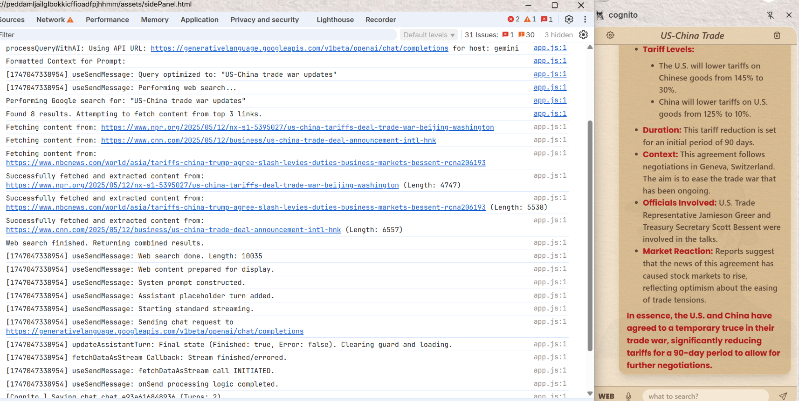
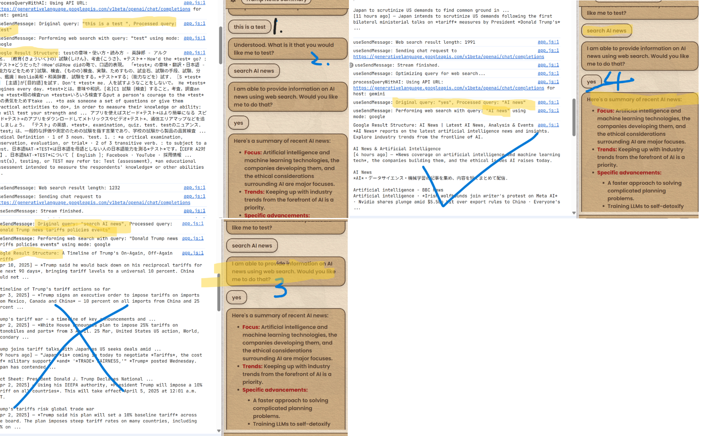

### webSearch 

**Features**

1.  **Modify Parsing:** Extract the actual URLs from the search results, not just the title and snippet.
2.  **Select Top Links:** Choose a limited number of top results to visit (e.g., the first 3) to keep it reasonably fast and avoid excessive requests.
3.  **Fetch Page Content:** For each selected URL, fetch its HTML content.
4.  **Extract Main Content:** Parse the fetched HTML and try to extract the meaningful text content, stripping out boilerplate (headers, footers, ads, navigation). This is the trickiest part and often requires heuristics.
5.  **Combine Results:** Format the output to include the original snippet *and* the extracted content from the visited page.
6.  **Concurrency:** Fetch the linked pages concurrently to speed things up; it's much faster than clicking on them.




**Detailed Explanation**

1.  **`maxLinksToVisit` Parameter:** Added a parameter to `webSearch` to control how many links are visited (defaults to 3).
2.  **`extractMainContent` Helper:** A new function to fetch HTML, parse it, remove common clutter elements (scripts, styles, navs, footers, ads, etc.), and extract text from main content areas (`<main>`, `<article>`, etc.) or the body as a fallback. This is heuristic and might not be perfect for all websites.
3.  **URL Extraction:** Modified the SERP parsing logic for Google, Brave, and DDG to reliably extract the `href` attribute (the URL) along with the title and snippet.
4.  **Concurrent Fetching:** Uses `map` with `async` and `Promise.allSettled` to fetch the content of the selected links concurrently. `Promise.allSettled` is important because it waits for all promises to either resolve or reject, allowing you to handle individual fetch failures without stopping the entire process.
5.  **Individual Timeouts:** Each page fetch now has its own timeout (`AbortController`) to prevent one slow page from blocking everything.
6.  **Content Type Check:** Added a check to ensure the fetched content is `text/html` before trying to parse it.
7.  **Error Handling:** Improved error handling for both the initial SERP fetch and individual page fetches. Failed fetches will result in an error message within the final output for that specific result.
8.  **Output Formatting:** The final string now includes the Title, URL, Snippet, and the extracted `Content` (truncated to 1500 chars) for each visited result.
9.  **User-Agent & Headers:** Using a common browser User-Agent and standard `Accept` headers for both SERP and page fetches can help avoid being blocked by websites.
10. **`manifest.json` Permissions:** `"host_permissions": ["<all_urls>"]` to `manifest.json` file. Without this, the `fetch` calls to the search result URLs will be blocked by the browser's security policies.
11. **Complexity:** This significantly increases the complexity and execution time of `webSearch`. Visiting multiple pages takes time and resources.
12. **Website Variability:** The `extractMainContent` function is a best effort. Website structures vary wildly, and it might grab too little or too much content from some pages.


### The plan for further developments (aslo an example of current usage)

*In Page Mode*

user
tell me this extension's potential to use as AI agent? what else can this do with some effort?

assistant
Alright, let's break down the potential of the Cognito extension as an AI agent, based on the provided information. My assessment focuses on its current capabilities and logical future developments.

**Assessment of Current Potential as an AI Agent:**

Cognito already possesses several foundational components crucial for developing into a capable AI agent operating within the browser environment:

1.  **Core Intelligence:** It integrates with various powerful LLMs (Cloud & Local), providing the necessary reasoning and language understanding capabilities. This is the "brain" of any agent.
2.  **Environmental Perception:** The extension can read and understand its immediate environment – the content of web pages, including text, HTML structure, PDF content, and even transcripts (YouTube, Bloomberg). This is critical for context-aware actions.
3.  **Information Gathering:** The context-aware web search functionality allows it to retrieve external information relevant to its current task or the page content.
4.  **Task Decomposition (Crucial):** The "Computation Levels" feature (Medium and High) is a significant step towards agency. It explicitly implements task decomposition – breaking down complex user queries into smaller, manageable subtasks or stages. This mimics the planning phase of an AI agent. The described process (Decomposition -> Solve Subtasks/Steps -> Synthesis) is a simplified form of agentic workflow.
5.  **Developer Intent:** The documentation explicitly mentions the developer's goal: "Basically, I want to extend this to the 'AI agent'." This indicates a clear strategic direction.

**However, in its current state (based on the description), it likely falls short of being a *fully autonomous* agent:**

*   **Limited Action Space:** Its primary actions seem focused on reading, summarizing, and responding. True agency often requires the ability to *interact* more dynamically with the environment (e.g., clicking buttons, filling forms, navigating sites autonomously). The planned "Edit text content" is a step in this direction, but still limited.
*   **Rudimentary Planning/Execution:** While the Computation Levels show planning, the sophistication and adaptability of this planning might be basic compared to dedicated agent frameworks (like ReAct, AutoGPT, etc

user
what can this do? give me some example? like if I can mark highlight in a rss page, show me news about xxx

assistant
Okay, an excellent question! Let's break down what Cognito can likely do *now*, based on its described features, and then explore how the specific RSS feed example would fit in.

**Current Capabilities (Based on the Description):**

Cognito, as it stands, seems to be a powerful in-browser information processing tool. Here's what it can likely do, with examples:

1.  **Understanding & Summarization:**
    *   **Example:** You're on a long news article or a dense academic paper. You can select a portion (or the whole page) and ask Cognito to:
        *   "Summarize this in 3 bullet points."
        *   "Explain this concept like I'm a beginner."
        *   "What are the key arguments presented here?"

2.  **Information Extraction & Answering Questions:**
    *   **Example:** You're on a product page with many specifications.
        *   "What is the battery life of this device?"
        *   "Does this product support Bluetooth 5.0?" (Cognito would scan the page for this info).

3.  **Content Transformation:**
    *   **Example:** You've written a paragraph and want to improve it.
        *   "Rewrite this to be more formal."
        *   "Translate this selected text into Spanish."
        *   "Check this text for grammatical errors."

4.  **Contextual Web Search & Information Augmentation:**
    *   **Example:** You're reading about a historical event, say "The Battle of Hastings." You can select "William the Conqueror" and ask Cognito:
        *   "Find more information about this person."
        *   "What were the long-term consequences of this battle?" (It would use the page context and potentially search the web).

5.  **Multi-Step Reasoning (via "Computation Levels"):**
    *   This is where it gets more interesting and closer to agent-like behavior.
    *   **Example (Medium Computation):** You're on a Wikipedia page about a complex scientific theory. You could ask: "Explain the main postulates of this theory and then list three common criticisms of it." Cognito would first identify the postulates, then search for/identify criticisms.
    *   **Example (High Computation):** You're researching a company. You could ask: "Summarize this company's 'About Us' page, then search for recent news about their stock performance, and finally, list their main competitors mentioned on this page." This involves multiple steps: summarization, targeted web search, and then further information extraction from the original page.

**Now, let's address your specific example: "If I can mark/highlight in an RSS page, show me news about xxx"**

Yes, this is well within the realm of what Cognito could do, likely with its existing architecture, especially leveraging its "on selected text" context and web search capabilities.

Here's how it would likely work, step-by-step:

1.  **User Action:** You are on an RSS feed page (e.g., Feedly, or a direct XML feed rendered in the browser). You see a headline or a snippet that interests you, for example, "New Advancements in Quantum Entanglement." You highlight this text.
2.  **Cognito's Trigger:** You would then activate Cognito, likely through a right-click context menu option that appears when text is selected, or a keyboard shortcut.
3.  **Instruction to Cognito:** You could have a pre-defined custom prompt or type a new one.
    *   **Simple version:** "Find recent news about [selected text]."
    *   **More specific version:** "Show me the top 3 news articles published in the last 24 hours about [selected text]."
4.  **Cognito's Process (likely using Medium or High Computation):**
    *   **Step 1 (Input):** Cognito captures the highlighted text ("New Advancements in Quantum Entanglement").
    *   **Step 2 (Query Formulation):** It uses this text to formulate a search query, possibly refining it (e.g., adding "news," "latest," or date parameters if you specified).
    *   

user
That's a good usage. thanks. adding a context menu would be a good idea when that's open and web search is already there. but what about let llm mark on page directly? can llm and cognito, the chrome extension do it?

assistant
You're thinking along very insightful lines! Yes, the idea of an LLM *directly initiating* actions on the page, like marking or highlighting, is a natural and powerful extension of its capabilities.

Let's analyze this:

**Can an LLM and Cognito (as a Chrome Extension) do this?**

**Conceptually, yes, this is absolutely achievable with some development effort.** It's a logical progression from reading and summarizing to actively modifying the visual presentation of the page based on LLM understanding.

Here's a breakdown of how it could work and the components involved:

1.  **LLM's Role (The "Decider"):**
    *   **Input:** Cognito would send the relevant page content (or selected text) to the LLM, along with a prompt. For example:
        *   "Highlight all sentences on this page that discuss financial risks."
        *   "Mark any mention of specific dates in the selected text."
        *   "Identify and highlight the key arguments supporting the main thesis of this article."
    *   **Processing:** The LLM would analyze the text and identify the specific words, phrases, or sentences that match the criteria in the prompt.
    *   **Output:** The LLM would need to return this information in a structured way. This could be:
        *   A list of the exact text strings to be highlighted.
        *   Potentially, if the LLM is sophisticated or fine-tuned for this, it might even attempt to provide contextual information (e.g., "the third sentence in the second paragraph"). However, relying solely on text strings is more robust initially.

2.  **Cognito's Role (The "Actor" / "Enabler"):**
    *   **Receiving LLM Instructions:** Cognito gets the list of text strings (or other identifiers) from the LLM.
    *   **DOM Manipulation:** This is the core technical part for the extension. Cognito would need to:
        *   **Scan the Document Object Model (DOM):** Programmatically search the current webpage's HTML structure for the exact text strings provided by the LLM.
        *   **Apply Styling:** Once a match is found, Cognito would use JavaScript to wrap the found text in an HTML element (like a `<span>`) and apply a style to it (e.g., `background-color: yellow;` for highlighting).
    *   **User Interface (Optional but Recommended):**
        *   A way to clear highlights.
        *   Perhaps different colors for different types of highlights (e.g., one color for "key terms," another for "questions to research").
        *   A way to trigger this action (e.g., a new option in the Cognito popup/context menu).

**The "Edit text content" feature you mentioned Cognito is planning is a *very* strong indicator that this is feasible.** If the extension can be architected to *edit* text on a page (which involves identifying text and replacing/modifying it), then *highlighting* text (which involves identifying text and wrapping it with styled tags) uses very similar underlying mechanisms. Highlighting is essentially a non-destructive visual edit.

**Example Workflow: "Highlight all mentions of Project X on this page"**

1.  **User:** You're on a long internal company document. You activate Cognito.
2.  **Prompt to Cognito:** "Highlight all mentions of 'Project Chimera' in yellow and all mentions of 'Project Griffin' in green."
3.  **Cognito to LLM:** Sends the page content and the structured request to the LLM.
4.  **LLM to Cognito:** Returns:
    ```json
    {
      "highlights":

user
That's fantastic, but could we get more from freedom to leverage LLM? prompts not sticking to peculiar string, we just use, "highlight news about US-China trade war in this page" 

assistant
Ah, an excellent and very intuitive leap! You're suggesting a much more powerful and flexible interaction model: **moving from explicit string identification to semantic understanding and action.**

Yes, this is precisely where the true potential of leveraging an LLM within an extension like Cognito lies. Instead of you telling it *what specific string* to find, you tell it *what concept or information* you're interested in, and the LLM does the heavy lifting of interpreting your intent and finding the relevant parts of the page.

Let's break down how "highlight news about US-China trade war in this page" could work, and the increased sophistication required:

**Is it Feasible?**

Absolutely. This leverages the core strengths of LLMs: natural language understanding and contextual analysis.

**How it Would Work (Conceptual Steps):**

1.  **User Input:** You type the free-form prompt into Cognito: "Highlight news about the US-China trade war on this page."
2.  **Cognito Pre-processing (Optional but good):**
    *   Cognito grabs the main textual content of the current webpage.
    *   It might perform some light cleaning or structuring of this text.
3.  **Prompt Engineering by Cognito:** Cognito would take your natural language query and combine it with the page content, forming a more detailed prompt for the LLM. This is crucial. It might look something like this (simplified):

    ```
    System: You are an AI assistant tasked with identifying relevant sections of text on a webpage.
    User: The following is the content of a webpage:
    [... entire text content of the page ...]

    Based on the content above, identify and extract all sentences or paragraphs that constitute or discuss "news about the US-China trade war".
    Your output should be a list of the exact text segments you identify as relevant.
    If no relevant sections are found, respond with "No relevant information found."
    ```
4.  **LLM Processing:** The LLM receives this comprehensive prompt. It will:
    *   Understand the user's intent ("US-China trade war," "news").
    *   Read and analyze the provided page content.
    *   Semantically identify sentences, paragraphs, or sections that match the criteria. This is not just keyword spotting; it's about understanding meaning and context. For example, it should differentiate between a historical mention and current news.
5.  **LLM Output:** The LLM would return a structured response, ideally a list of the actual text snippets it deemed relevant.
    *   Example: `["The latest tariffs imposed by Washington have led to retaliatory measures from Beijing, escalating concerns.", "Stock markets reacted nervously to the announcement of new trade restrictions between the two economic giants."]`
6.  **Cognito Action (DOM Manipulation):**
    *   Cognito receives this list of text snippets.
    *   For each snippet, Cognito searches the page's DOM to find that exact text.
    *   Once found, it applies the highlighting (e.g., wrapping it in a `<span>` with a background color).

**Increased Complexity and Considerations:**

*   **Precision of LLM Output:** The main challenge is ensuring the LLM returns *exact, findable text snippets* from the original page. If it paraphrases or summarizes what it thinks is relevant, Cognito won't be able to find that exact string on the page to highlight. The prompt engineering in step 3 is key to guiding the LLM to do this.
*   **Handling Ambiguity and Scope:**
    *   What if the LLM finds a very long paragraph where only one sentence is truly relevant? Should it return the whole paragraph or just the sentence? The prompt needs to guide this.
    *   What if the "news" is spread across multiple non-contiguous paragraphs? The LLM should ideally return each relevant piece.
*   **Performance:** Sending the entire page content to an LLM and waiting for a detailed analysis can take time, especially for very long pages. Optimizations might be needed (e.g., chunking the page content and processing chunks, though this adds its own complexity for contextual understanding).
*   **Cost (if using cloud LLMs):** Processing large amounts of text repeatedly will have API cost implications.
*   **User Experience for No Matches:** If the LLM finds nothing, Cognito should clearly inform the user.
*   **Refinement Loop (Advanced):** For even better results, one could imagine a multi-step process:
    1.  LLM identifies potentially relevant *sections* (e.g., "Paragraphs 5-7 seem relevant").
    2.  Cognito presents these sections (or summaries) to the user: "I found 3 sections that might be about the US-China trade war. Would you like me to highlight them, or refine the search within these sections?"
    3.  This allows for more precise control and reduces the chance of highlighting irrelevant information.

**Why this is a Significant Step Up:**

*   **Natural Interaction:** Users don't need to think like programmers or search engines; they can express their needs naturally.
*   **Deeper Understanding:** It moves beyond simple keyword matching to semantic understanding of the content.
*   **Proactive Assistance:** The LLM isn't just responding to what's selected; it's actively analyzing the whole page based on a broader instruction.

So, yes, your idea is not only feasible but also points directly towards a more intelligent and intuitive way for AI agents to assist users within their browsing environment. The "edit text content" feature Cognito plans is a foundational block, and this "semantic highlighting" is a very logical and powerful application built on top of that foundation and the LLM's capabilities.

It would require careful design of the interaction flow, robust prompt engineering, and clever handling of the LLM's output to ensure the highlighting is accurate and useful. A fascinating challenge!

user
ah, also the tool use, right? like sending words to search, and, I don't know if we can let llm highlight key words and sentence to help user to understand the article, like extractive summary directly in the article.

assistant
You're hitting on two very powerful advancements for an AI agent operating within a browser: **autonomous tool use** and **in-situ content augmentation based on semantic understanding.** These are absolutely key to making an extension like Cognito a truly intelligent assistant.

Let's dissect these concepts:

**1. Autonomous Tool Use (e.g., "send words to search")**

This is a cornerstone of sophisticated AI agents (often seen in frameworks like ReAct, LangChain agents, or AutoGPT).

*   **Current State (Likely):** Cognito's web search is probably triggered explicitly by the user selecting text and choosing a "search" option.
*   **The Leap to Tool Use:** The LLM itself decides *when* and *what* to search, without explicit user instruction for *that specific search action*.
    *   **How it would work:**
        1.  **User's Broader Goal:** You give Cognito a complex task, e.g., "Summarize this article about Company X and tell me if their stock has gone up in the last week."
        2.  **LLM's Internal Reasoning:**
            *   The LLM processes the article on the page to summarize it.
            *   It then recognizes that the second part of the query ("stock gone up in the last week") cannot be answered from the current page content.
            *   It decides it needs to use a "tool"—in this case, its web search capability.
        3.  **LLM Instructs Cognito:** The LLM doesn't just tell *you* to search; it formulates a query (e.g., "Company X stock price change last 7 days") and signals to the Cognito extension: "Execute web search with this query."
        4.  **Cognito Executes:** The extension performs the web search in the background.
        5.  **Cognito Returns Results to LLM:** The search results (e.g., snippets from top search hits) are fed back to the LLM as new context.
        6.  **LLM Synthesizes:** The LLM now combines its summary of the original article with the information from the web search to provide a complete answer to your initial query.
    *   **Strategic Implication:** This makes Cognito far more resourceful. It can actively seek out information it needs to fulfill your requests, rather than being limited to the current page or explicitly selected text. This is a significant step towards true "agency."

**2. In-Article Extractive Summary (Highlighting Key Words/Sentences)**

This is an excellent application of the "LLM directs DOM manipulation" idea we discussed, specifically for comprehension.

*   **Concept:** Instead of (or in addition to) providing a summary in a separate popup, the LLM identifies the most crucial sentences or phrases *within the article itself* and Cognito highlights them directly on the page.
*   **How it would work:**
    1.  **User Prompt:** "Highlight the key points of this article" or "Show me an extractive summary on this page."
    2.  **Cognito to LLM:** Sends the page content and the prompt.
    3.  **LLM Analysis:** The LLM reads the entire article and identifies the sentences that best represent the core message, main arguments, or critical data points. This is an "extractive summarization" task.
    4.  **LLM Output:** Returns a list of these exact sentences (or precise identifiers if the page structure is very complex/dynamic).
    5.  **Cognito Action:** Finds these exact sentences in the page's DOM and applies a highlighting style.
*   **Benefits:**
    *   **Contextual Understanding:** You see the summary points *within their original context*, which can be much richer than a disembodied summary.
    *   **Guided Reading:** It acts as a visual guide, drawing your attention to the most important parts, especially useful for long or dense texts.
    *   **Efficiency:** Quickly grasp the essence without needing to read every word, but easily read surrounding text if a highlighted point piques interest.
*   **Variations:**
    *   **Highlighting Key Terms:** "Highlight the main technical terms in this document."
    *   **Highlighting Questions Raised:** "Point out any unanswered questions or areas for future research mentioned here."
    *   **Highlighting Evidence:** "Show me the sentences that provide evidence for the main claim."

**The Interplay:**

Imagine the power when these two combine:

1.  You ask Cognito: "On this news aggregator page, highlight any articles discussing breakthroughs in renewable energy from the last month and summarize the main breakthrough for each."
2.  **LLM + Tool Use:**
    *   The LLM might first scan the headlines/snippets on the aggregator.
    *   For articles that seem relevant but lack detail, it might decide to use its "web search" or "navigate to page and read" tool (if it had that capability) to get more information.
3.  **LLM + In-Article Highlighting/Summarization:**
    *   Once it has sufficient information, it instructs Cognito to highlight the relevant article titles/snippets on the *aggregator page*.
    *   Then, perhaps in a popup or when you hover over a highlighted item, it provides the requested summary of the breakthrough.

**In summary:**

Yes, enabling the LLM to autonomously use tools like web search, and to direct in-page modifications like highlighting for extractive summaries, are precisely the kinds of capabilities that would transform Cognito from a smart assistant into a more proactive and integrated AI agent. This requires robust communication between the LLM and the extension's functions, and careful prompt engineering to guide the LLM's decisions and outputs. The "edit text content" feature is a great stepping stone for the DOM manipulation part.

These are exciting and logical next steps for maximizing the freedom to leverage LLM intelligence within the browser!