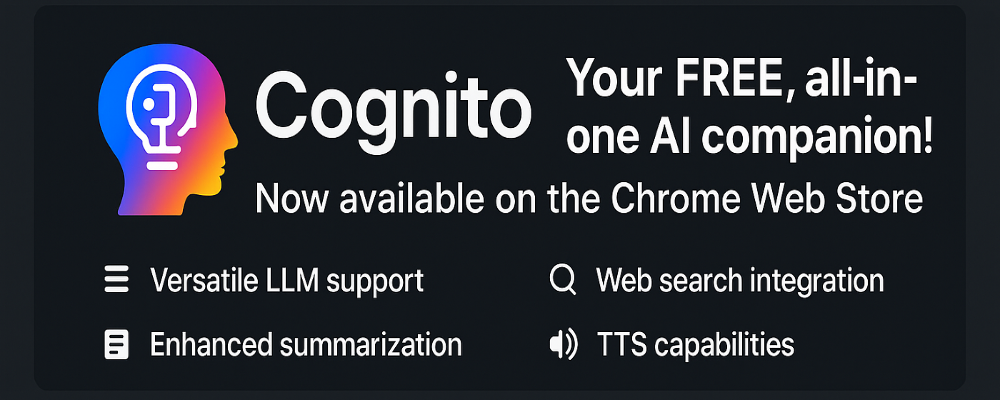
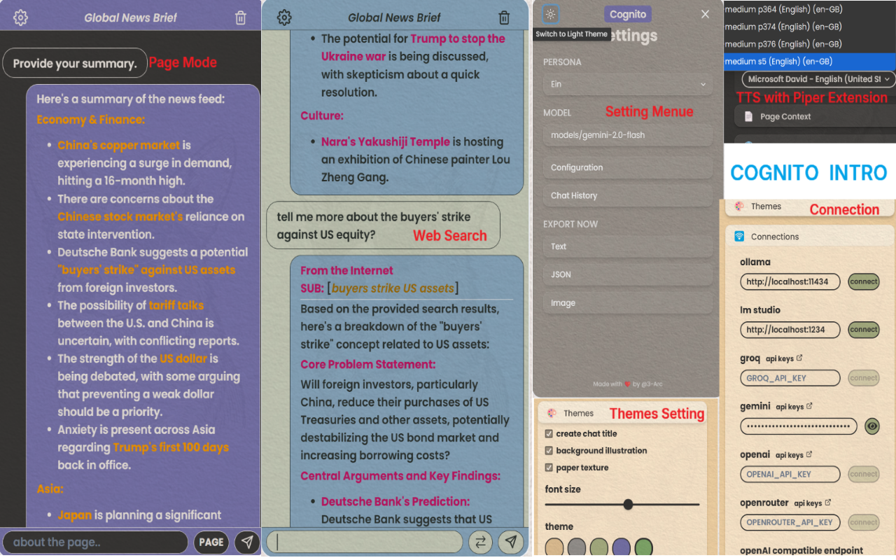

# Cognito: Your All-in-One AI Companion for Browser LLMs

Cognito is your FREE, all-in-one AI companion, now available directly from the Chrome Extension Store! This powerful extension brings the capabilities of Large Language Models (LLMs) to your browser, allowing you to summarize web pages, interact directly with page content, conduct context-aware web searches, read out the responses, and more. Choose between cloud-based services like OpenAI and Gemini or run models locally with Ollama and LM Studio. **Install Cognito today and enjoy AI in your browser!**

Built on [sidellama](https://github.com/gyopak/sidellama).
## Roadmap

*   Bug fixes and improvements.
*   Evaluate and integrate pull requests.
*   ~Migrate to Shadcn/ui from Chakra-UI V2,~ and ~React 19~.
*   Search with API for wikipedia/kiwix(zim-reader)
*   Search with API for Google
*   Simple tool use to enhance the current web search to reduce the cost of running LLM and get a better result.
*   Better local TTS/STT by API.
*   Replace 'deep research' with local/basic API services (even free tier)
*   "Memory" for the chat history with RAG and search.
*   Comparison mode (RAG or hybrid search can do this).
## Screenshot

## Key Features

*   **Versatile LLM Support:**
    *   **Cloud LLMs:** Compatible with any OpenAI API-compliant service: OpenAI, Gemini, GROQ, OPENROUTER. Plus one.
    *   **Local LLMs:** Seamlessly integrates with:
        *   Ollama
        *   LM Studio
        *   GPT4All
        *   Jan
        *   Open WebUI
        *   ...and any other platform that exposes an OpenAI-compatible API!

*   **Diverse Personas:** Seven pre-built personas designed to cater to specific needs (see below).
*   **Web Search Integration:** Enhanced access to information for context-aware AI interactions.
*   **Page context reading** Transcripts reading included for Bloomberg, YouTube, or other providers who put the transcripts in their HTML.
*   **Enhanced Summarization** More granular control over summary length and detail over personas.
*   **TTS** Currently, there is only basic TTS from the browser, so if you want some natural voices, you should use Edge or you have integrated TTS API from elsewhere. https://github.com/ken107/piper-browser-extension Here is an excellent Chrome extension that can add a local TTS service directly to Chrome, so you can find the downloaded models in the select dropdown in settings. And I found some https://github.com/remsky/Kokoro-FastAPI https://github.com/Lex-au/Orpheus-FastAPI, maybe we can integrate with them too. I have put a .tsx like that in the files anyway. I will look into this further. I hope someone can add this if possible, because so far it's good enough for me. But still, it's better to have some more choices without breaking anything.
*   **Computation Levels** New function, https://github.com/AlexBefest/highCompute.py, I use this idea and some of his code. Thanks. **WARN: STILL TESTING - Please use your local LLM, it will trigger resource exhaustion. Even though I add one second decay to every prompt to avoid concurrent prompts. And from the [readme](https://github.com/AlexBefest/highCompute.py) it might be good for coding, but the result is meh for paperwork, I guess.** check my test 'making 3k in one day' [low](https://github.com/user-attachments/assets/ea26cf72-393b-4027-a26a-058086b1dd71) check [medium](https://github.com/user-attachments/assets/9ebfd187-4f3f-4370-846e-3c7c3c5e5c19) After checking logs, it appears to be my code and prompt are fine, it just needs a better model. QWEN 3 8B is good enough for simple QA, but it falls short when it comes to complex instructions in automatic procedures. So you need a good local model to run it here, or you can just use the 'deep research' function directly in their websites. I will try to optimize the query processing and prompts.

## Computation Levels: Tailor AI Power to Your Task (Beta)

Cognito now offers adjustable Computation Levels, allowing you to fine-tune the AI's processing power to match the complexity of your query. This groundbreaking feature lets you choose between **Low, Medium, and High** compute modes, each strategically designed for different task types. By decomposing complex problems into smaller, manageable parts, Cognito can achieve more accurate and nuanced results.

*   **Low:** Direct query to the LLM for a quick response. Ideal for simple questions and standard chat.
*   **Medium:** Single-level task decomposition for moderately complex queries, breaking down the task into subtasks and synthesizing the results.
*   **High:** Two-level task decomposition (stages → steps) for highly complex, multi-component tasks. This mode allows for in-depth planning and problem-solving.

**How It Works:**

*   **Low:** `User Query → LLM (single call) → Response`
*   **Medium:** `User Query → LLM (decomposition) → Subtasks → LLM (solve subtasks) → Synthesis → Final Answer`
*   **High:** `User Query → LLM (Level 1 decomposition) → Stages → LLM (Level 2 decomposition) → Steps → LLM (solve steps) → Synthesis → Stage Results → Synthesis → Final Answer`

**Flexible Adjustment:** You can seamlessly switch between Compute Levels within a single conversation to optimize performance and resource usage.

**Important Considerations (Beta Phase):**

*   **Experimental Feature:** The Computation Levels feature is currently in **beta**. We encourage experimentation and feedback!
*   **Token Usage:** Higher Compute Levels significantly increase token consumption. **High Compute can use 100-150x more tokens than Low Compute for the same query.**
*   **Cost Implications:** If you're using a paid LLM API (e.g., OpenAI), be mindful of the potential cost increase with Medium and High Compute. Monitor your API usage closely.
*   **Processing Time:** Expect longer processing times with Medium and High Compute as the AI performs multiple decomposition and synthesis steps.
*   **Potential Instability:** As a beta feature, unexpected behavior may occur. Please report any issues you encounter.

By carefully selecting the appropriate Computation Level, you can unlock the full potential of Cognito while managing your resources effectively. We believe this feature will provide a significant boost in the quality of AI-driven problem-solving.
   
## Available Personas

Cognito offers the following personas to tailor the AI's behavior to your specific needs:

*   **Ein:** Academic researcher
*   **Warren:** Business analyst
*   **Charlie:** Friendly assistant
*   **Agatha:** Creative thinker
*   **Jan:** Strategist
*   **Sherlock:** Detective
*   **Bruce:** All-around assistant

See the [documentation](DOCS.md) for a complete overview of each persona's capabilities.

## Installation

### Download the Latest Release

1.  Download the latest release from [here].
2.  Enable Chrome Extensions > Developer mode.
3.  Load the content of the extracted zip with the "Load unpacked" button.

### Install from Source

1.  Clone the repository: `git clone https://github.com/3-ark/Cognito.git`
2.  Run `npm i && npm start` to generate your bundle, located in `dist/chrome`.
3.  Enable Chrome Extensions > Developer mode.
4.  Load the content of the `dist/chrome` folder with the "Load unpacked" button.

## Documentation

For detailed usage instructions, persona guides, and troubleshooting, please refer to the [documentation page](DOCS.md).

## Contributing

Contributions are welcome!

https://github.com/stanford-oval/WikiChat

## License

MIT License - see the [LICENSE](LICENSE) file for details.

